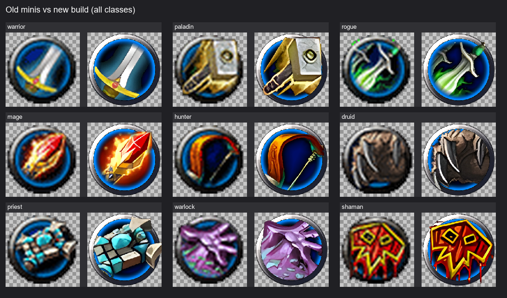
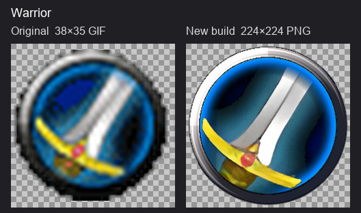
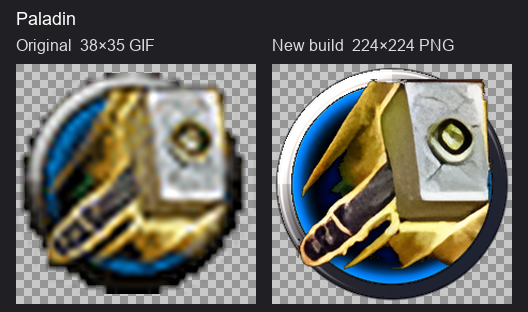
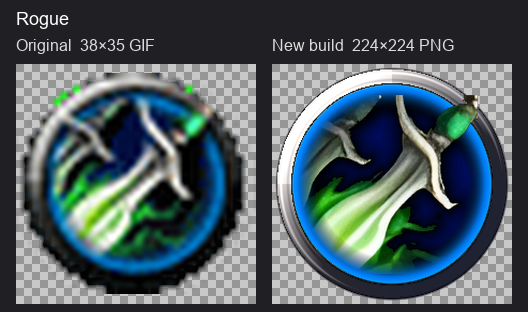
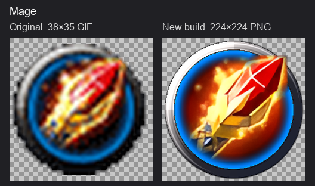
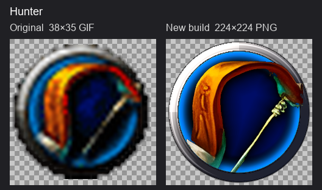
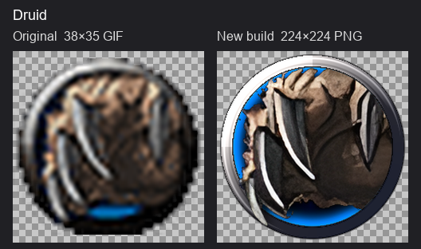
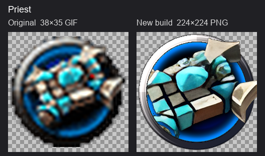
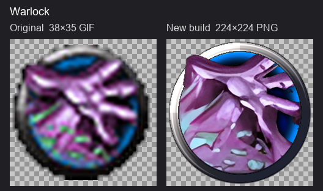
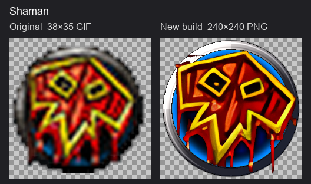

# Old School Class Icons

Warcraft III–style class icons with metallic ring, blue inner haze, and per-class art layering.

## Quick start

```bash
pip install -r requirements.txt
python build_class_icons_old_school.py
```

Requires Python 3.10+.

## Folder layout

| Path | Description |
|------|-------------|
| `sources/` | Input class art PNGs (one per class) |
| `*.png` (root) | Final composited icons |
| `layer1_border/` | Metallic ring + disc |
| `layer2_haze/` | Blue inner haze ring |
| `layer3_cutout/` | Scaled subject cutout |
| `layer4_base/` | Base art layer (behind haze) |
| `layer4_art_aura/` | Warrior teal aura split (warrior only) |
| `layer4_mid/` | Mid layer (above haze, behind ring) |
| `layer5_front/` | Front overhang (above ring) |
| `build_class_icons_old_school.py` | Builder script and all tuning constants |
| `comparison/` | Side-by-side old vs new images (see below) |
| `make_comparisons.py` | Regenerate `comparison/` after rebuilding icons |

## Classes

warrior, paladin, rogue, mage, hunter, druid, priest, warlock, shaman

## Tuning

Edit constants at the top of `build_class_icons_old_school.py` — art scale, paste offsets, haze arcs, and per-class promote/clip zones.

## Comparison vs original WC3 minis

The **final icons in this folder** are a modern rebuild of the classic Warcraft III class minis. Originals: `C:\Users\jeb32\OneDrive\Documents\class icons\old minis` (not bundled here).

### All classes (overview)

Left = original 38×35 mini · Right = new build



### Per class



















Regenerate after rebuilding icons:

```bash
python make_comparisons.py
```

### At a glance

| | Original minis (`old minis/`) | New build (this folder) |
|--|-------------------------------|-------------------------|
| **Resolution** | 38×35 px | 224×224 px (240×240 for shaman — follows source size) |
| **Format** | GIF (8 classes) + PNG (shaman), ~1 KB each | RGBA PNG, ~56–84 KB each |
| **Art source** | Original in-game assets | Upscaled PNGs in `sources/`, background removed |
| **Ring / frame** | Flat baked-in silver rim | Procedural beveled metallic ring (`layer1_border/`) |
| **Blue glow** | Simple flat cyan disc baked into art | Separate inner haze ring (`layer2_haze/`) with per-class arc fades |
| **Layering** | Single flat image | Multi-layer stack: base → haze → mid → ring → front |
| **Overhang** | None — art clipped to circle | Per-class sectors (blades, bows, crystals, etc. past the ring) |
| **Rebuildable** | No | Yes — `python build_class_icons_old_school.py` |

Ring proportions and haze placement were measured from the 38×35 reference GIFs (`OUTER_R_RATIO`, `RIM_RATIO`, etc. in the script).

### File mapping

| Class | Original (`old minis/`) | New output |
|-------|-------------------------|------------|
| warrior | `Warrior_Icon.gif` | `warrior.png` |
| paladin | `Paladin_Icon.gif` | `paladin.png` |
| rogue | `Rogue_Icon.gif` | `rogue.png` |
| mage | `Mage_Icon.gif` | `mage.png` |
| hunter | `Hunter_Icon.gif` | `hunter.png` |
| druid | `Druid_Icon.gif` | `druid.png` |
| priest | `Priest_Icon.gif` | `priest.png` |
| warlock | `Warlock_Icon.gif` | `warlock.png` |
| shaman | `Shaman_Icon.png` | `shaman.png` |

### What changed visually

**Overall**
- Much higher resolution and smoother edges from upscaled source art.
- Stronger blue inner haze with a soft falloff at the ring lip (not a flat fill).
- Thicker, lit metallic ring with top-left highlight and bottom-right shadow.
- Dark pixelated inner core and drop shadow behind the subject.

**Per-class highlights** (vs the flat originals)
- **Warrior** — Teal aura split to its own layer; handle/crossguard promoted above haze with spatial masks; haze arc gap (~150°–270°, 50° feather) fades around the grip.
- **Mage** — Crystal/fire overhang above the ring; haze arc gap at top-right (~12°–73°).
- **Rogue** — Daggers and TR handle overhang; blade tucks behind the ring on the left arc.
- **Hunter** — Bow overhang with arc clip on the grip.
- **Others** — Individual art scale, paste offset, and overhang sectors tuned to match each original silhouette.

**Trade-off**
- New files are larger (PNG vs 1 KB GIFs) and require Python to regenerate — in exchange you get editable layers and per-class compositing control.

