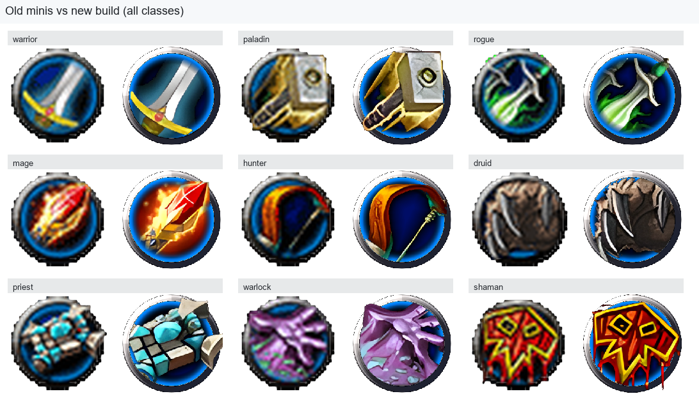
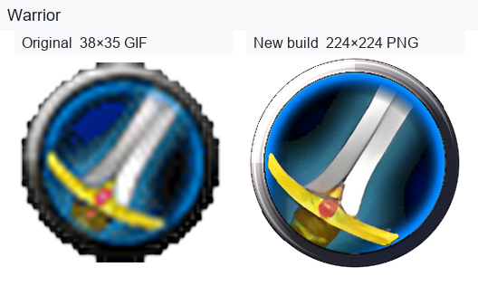
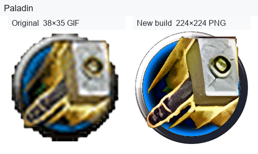
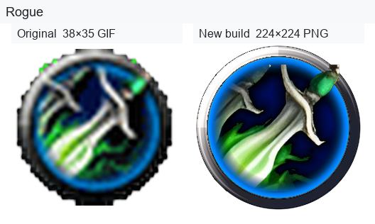
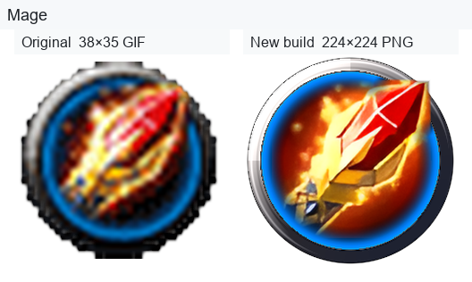
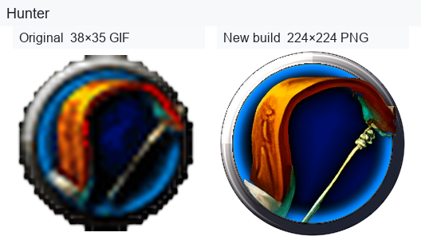
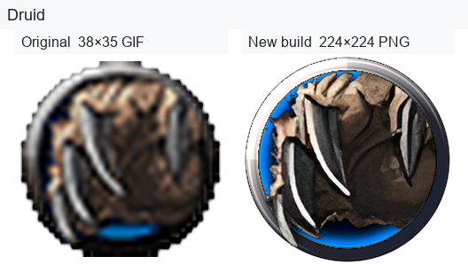
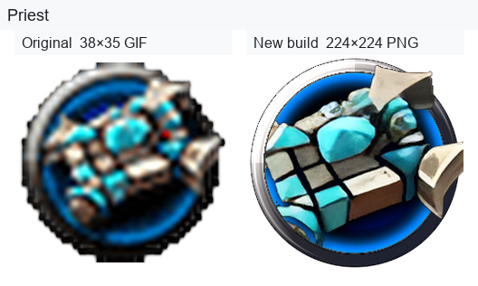
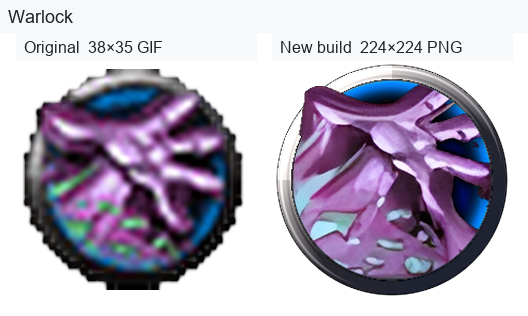
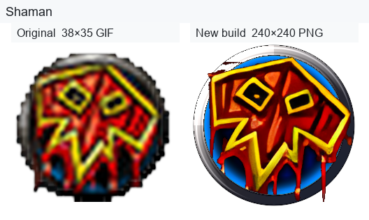

# Old School Vanilla/Classic WoW Class Icons

Requires Python 3.10+.

## Folder layout

| Path | Description |
|------|-------------|
| `sources/` | Input class art PNGs (one per class) |
| `*.png` (root) | Final composited icons |
| `layer1_border/` | Metallic ring + disc |
| `layer2_haze/` | Blue inner haze ring |
| `layer3_cutout/` | Scaled subject cutout |
| `layer4_base/` | Base art layer (behind haze) |
| `layer4_art_aura/` | Warrior teal aura split (warrior only) |
| `layer4_mid/` | Mid layer (above haze, behind ring) |
| `layer5_front/` | Front overhang (above ring) |
| `build_class_icons_old_school.py` | Builder script and all tuning constants |
| `comparison/github-dark/` | README images for GitHub dark theme |
| `comparison/github-light/` | README images for GitHub light theme |
| `comparison/transparent/` | True alpha PNGs (for editors; not for README) |
| `make_comparisons.py` | Regenerate all comparison variants |

## Classes

warrior, paladin, rogue, mage, hunter, druid, priest, warlock, shaman

## Tuning

Edit constants at the top of `build_class_icons_old_school.py` — art scale, paste offsets, haze arcs, and per-class promote/clip zones.

### All classes (overview)

Left = original 38×35 mini · Right = new build.

The PNGs in `comparison/transparent/` have real alpha, but **GitHub and most Markdown previews do not show that as see-through** — they either draw a grey/white checkerboard (Cursor, VS Code) or flatten transparency unpredictably. The README therefore uses theme-matched images via `<picture>`:

<picture>
  <source media="(prefers-color-scheme: dark)" srcset="comparison/github-dark/overview.png">
  <source media="(prefers-color-scheme: light)" srcset="comparison/github-light/overview.png">
  
</picture>

### Per class

<picture>
  <source media="(prefers-color-scheme: dark)" srcset="comparison/github-dark/warrior.png">
  <source media="(prefers-color-scheme: light)" srcset="comparison/github-light/warrior.png">
  
</picture>

<picture>
  <source media="(prefers-color-scheme: dark)" srcset="comparison/github-dark/paladin.png">
  <source media="(prefers-color-scheme: light)" srcset="comparison/github-light/paladin.png">
  
</picture>

<picture>
  <source media="(prefers-color-scheme: dark)" srcset="comparison/github-dark/rogue.png">
  <source media="(prefers-color-scheme: light)" srcset="comparison/github-light/rogue.png">
  
</picture>

<picture>
  <source media="(prefers-color-scheme: dark)" srcset="comparison/github-dark/mage.png">
  <source media="(prefers-color-scheme: light)" srcset="comparison/github-light/mage.png">
  
</picture>

<picture>
  <source media="(prefers-color-scheme: dark)" srcset="comparison/github-dark/hunter.png">
  <source media="(prefers-color-scheme: light)" srcset="comparison/github-light/hunter.png">
  
</picture>

<picture>
  <source media="(prefers-color-scheme: dark)" srcset="comparison/github-dark/druid.png">
  <source media="(prefers-color-scheme: light)" srcset="comparison/github-light/druid.png">
  
</picture>

<picture>
  <source media="(prefers-color-scheme: dark)" srcset="comparison/github-dark/priest.png">
  <source media="(prefers-color-scheme: light)" srcset="comparison/github-light/priest.png">
  
</picture>

<picture>
  <source media="(prefers-color-scheme: dark)" srcset="comparison/github-dark/warlock.png">
  <source media="(prefers-color-scheme: light)" srcset="comparison/github-light/warlock.png">
  
</picture>

<picture>
  <source media="(prefers-color-scheme: dark)" srcset="comparison/github-dark/shaman.png">
  <source media="(prefers-color-scheme: light)" srcset="comparison/github-light/shaman.png">
  
</picture>

Regenerate after rebuilding icons:

```bash
python make_comparisons.py
```
### File mapping

| Class | Original (`old minis/`) | New output |
|-------|-------------------------|------------|
| warrior | `Warrior_Icon.gif` | `warrior.png` |
| paladin | `Paladin_Icon.gif` | `paladin.png` |
| rogue | `Rogue_Icon.gif` | `rogue.png` |
| mage | `Mage_Icon.gif` | `mage.png` |
| hunter | `Hunter_Icon.gif` | `hunter.png` |
| druid | `Druid_Icon.gif` | `druid.png` |
| priest | `Priest_Icon.gif` | `priest.png` |
| warlock | `Warlock_Icon.gif` | `warlock.png` |
| shaman | `Shaman_Icon.png` | `shaman.png` |
